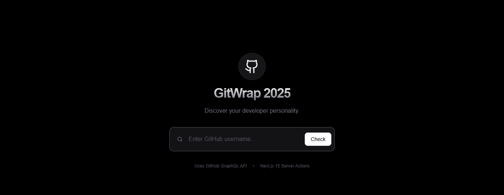
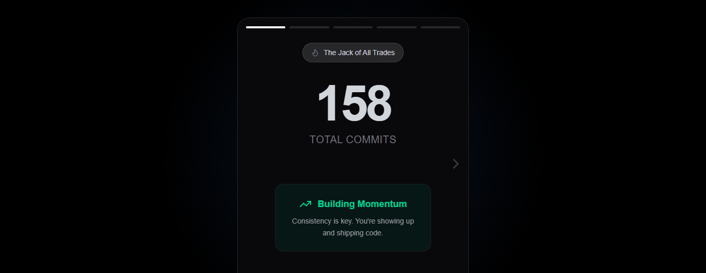
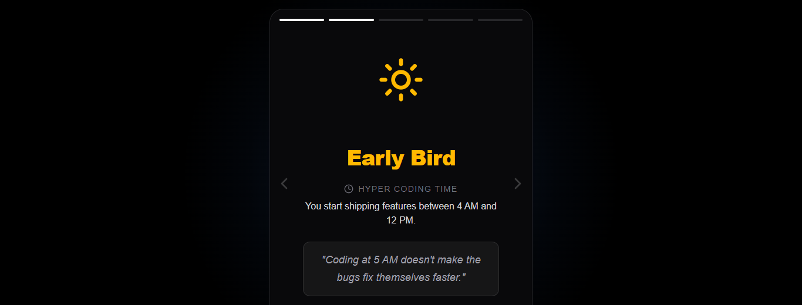
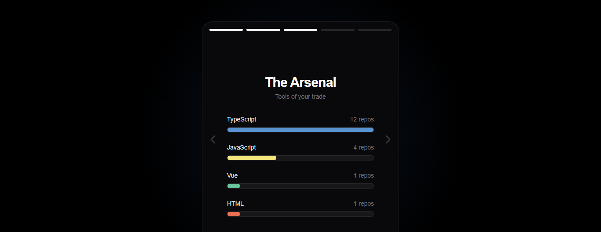
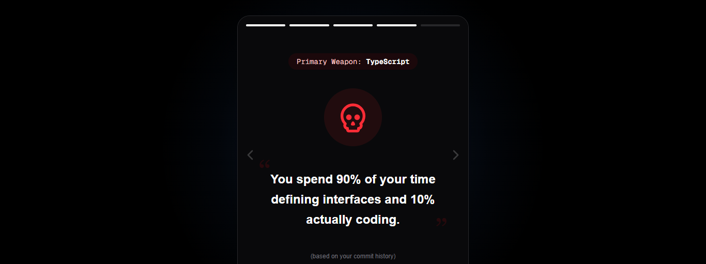
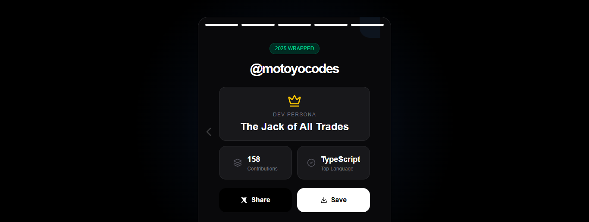
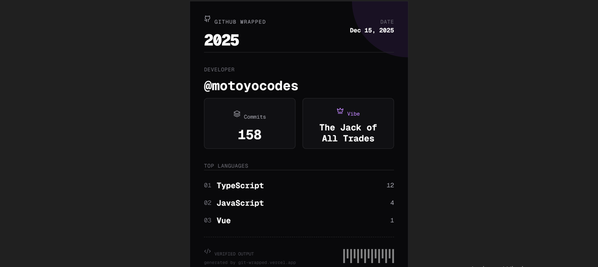

# Gitwrap

**Gitwrap** is a dynamic, interactive web application that analyzes your GitHub profile to generate a "Spotify Wrapped" style summary of your coding year. It calculates your coding hours, favorite languages, and commits, determines your "Developer Persona," and even roasts your coding habits.

[**View Live Demo**](https://your-domain.com) ·
[**Report Bug**](https://github.com/motoyocodes/gitwrap/issues)

## Features

- **The Grind:** Visualizes total contributions and commit streaks.
- **Hyper Coding Time:** Analyzes your commit timestamps to determine if you are an _Early Bird_, _9-to-5er_, or _Vampire Coder_.
- **The Arsenal:** A progress-bar visualization of your top used programming languages.
- **The Roast:** A witty, data-driven roast based on your commit history and language choices.
- **The Receipt:** Generates a downloadable, high-contrast digital receipt of your year's stats (perfect for sharing on X/Twitter).
- **Mobile-First Design:** Fully responsive UI with touch gestures and smooth animations.

## Tech Stack

- **Framework:** [Next.js 15](https://nextjs.org/) (App Router)
- **Styling:** [Tailwind CSS](https://tailwindcss.com/)
- **Animations:** [Framer Motion](https://www.framer.com/motion/)
- **Icons:** [Lucide React](https://lucide.dev/)
- **Data Fetching:** GitHub REST API
- **Image Generation:** [html2canvas](https://html2canvas.hertzen.com/) (For receipt downloads)
- **Language:** TypeScript

## Screenshots

| Landing Page  


| The Commit slide


| The Commit Time |


| Top languages |


| The Roast |


| The Summary |


| The Receipt |


## Getting Started

Follow these steps to set up the project locally on your machine.

### Prerequisites

- Node.js (v18 or higher)
- npm, yarn, or pnpm

### Installation

1.  **Clone the repository**

    ```bash
    git clone [https://github.com/motoyocodes/gitwrap.git](https://github.com/motoyocodes/gitwrap.git)
    cd gitwrap
    ```

2.  **Install dependencies**

    ```bash
    npm install
    # or
    yarn install
    ```

3.  **Set up Environment Variables**
    Create a `.env.local` file in the root directory. You need a GitHub Personal Access Token (PAT) to increase API rate limits.

    ```env
    NEXT_PUBLIC_GITHUB_TOKEN=your_github_pat_here
    ```

4.  **Run the development server**

    ```bash
    npm run dev
    ```

5.  **Open your browser**
    Navigate to `http://localhost:3000` to see the app running.

---

## Project Structure

```bash

├── app/
│   ├── api/og/
│   │   └── route.tsx      # Open Graph image generation
│   ├── wrap/[username]/
│   │   └── page.tsx       # Main wrapper entry point (Dynamic Route)
│   ├── globals.css        # Global styles
│   ├── layout.tsx         # Root application layout
│   ├── page.tsx           # Landing page (Search input)
│   └── slideSummary.tsx   # Summary/Bento Grid Slide
├── components/
│   ├── slides/
│   │   ├── slideClock.tsx     # 'Hyper Coding Time' slide
│   │   ├── SlideGrind.tsx     # 'The Grind' stats slide
│   │   ├── SlideLanguages.tsx # 'The Arsenal' slide
│   │   └── slideRoast.tsx     # 'The Roast' slide
│   ├── Receipt.tsx            # Hidden component for image generation
│   └── StoryContainer.tsx     # Main swiper/navigation logic
├── lib/
│   ├── github.ts          # GitHub API fetching logic
│   ├── roast.ts           # Roast generation logic
│   ├── transformData.ts   # Data processing/formatting
│   └── utils.ts           # Utility functions (Tailwind merge, etc.)
└── public/
    └── comits.png         # Static assets

## How It Works
Data Collection: The app fetches public data from the GitHub API, including user details, repositories, and commit history for the current year.

Transformation: We process raw commit dates to calculate "Time of Day" vibes and aggregate language bytes to find top languages.

Persona Assignment: Based on the data, the user is assigned a specific "Vibe" (e.g., The Weekend Warrior, The Architect).

Rendering: Framer Motion handles the slide transitions, while the receipt is rendered off-screen and captured via Canvas API for downloading.

## Contributing
Contributions are what make the open-source community such an amazing place to learn, inspire, and create. Any contributions you make are greatly appreciated.

Fork the Project

##Create your Feature Branch (git checkout -b feature/AmazingFeature)

Commit your Changes (git commit -m 'Add some AmazingFeature')

Push to the Branch (git push origin feature/AmazingFeature)

Open a Pull Request

License
Distributed under the MIT License. See LICENSE for more information.

Made with love and light by motoyocodes
```
